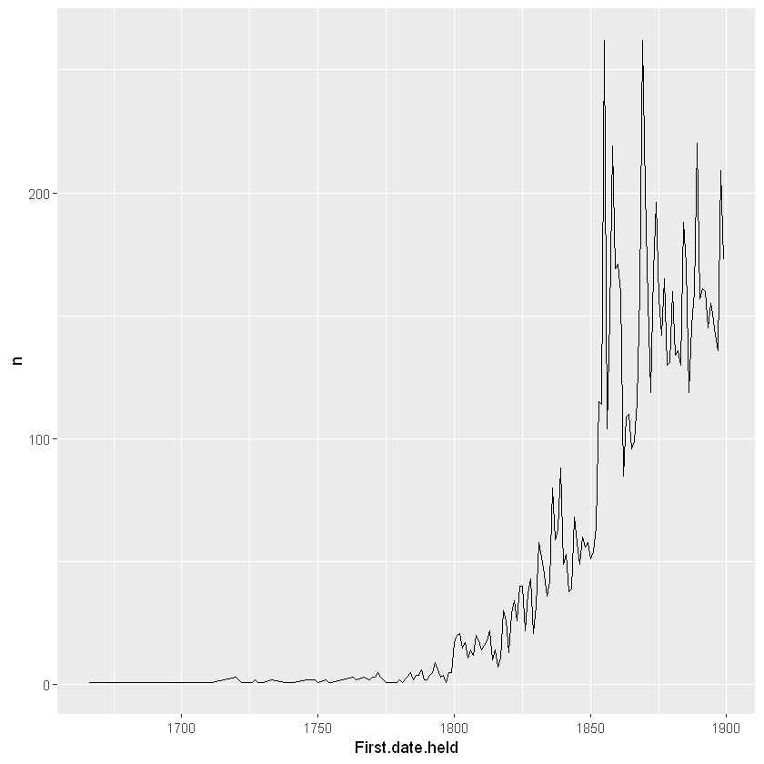
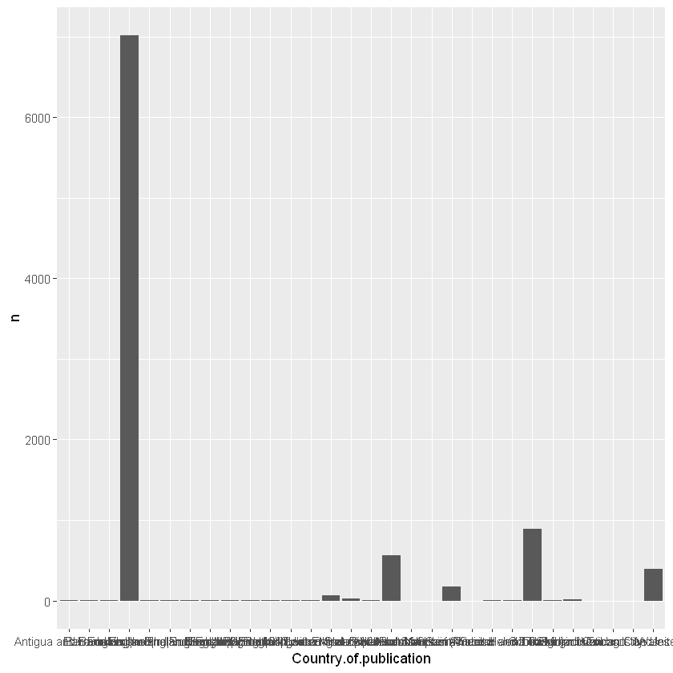
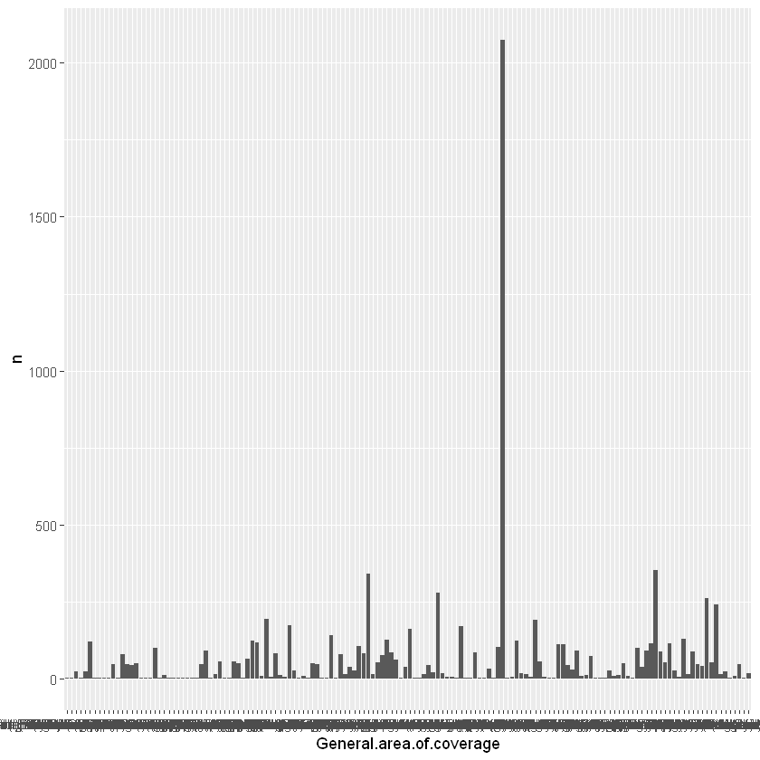
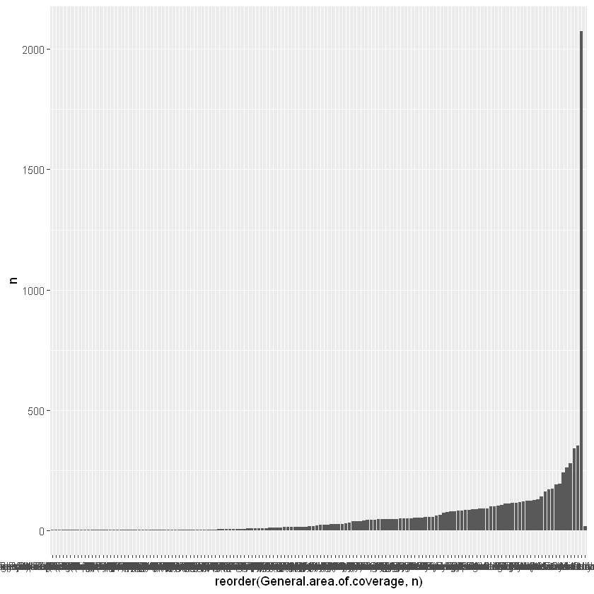
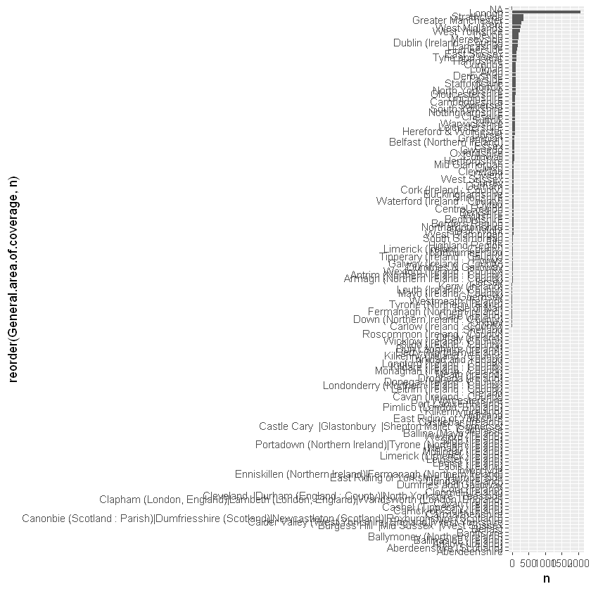
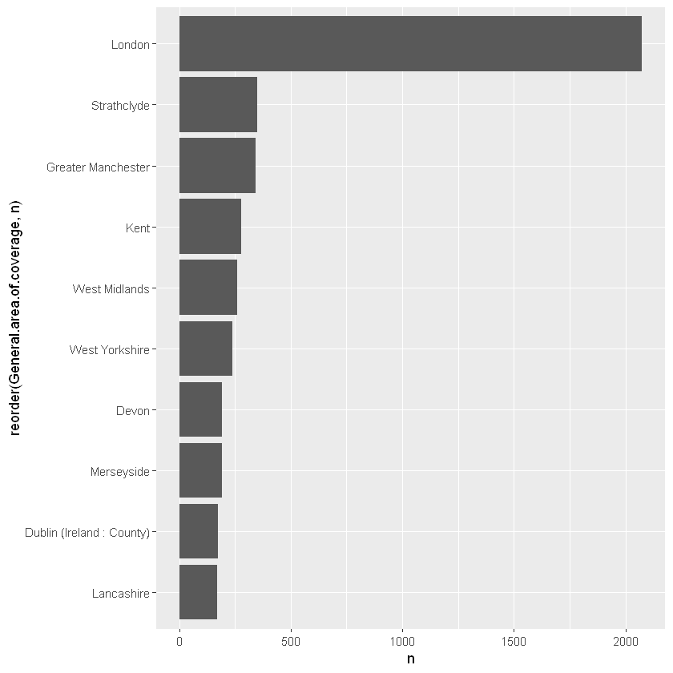

# The British Library Newspaper Titles: Some Basic Numbers

### How many titles does the British Library hold? When were they published? This document is intended to answer a few basic questions about the Library's newspaper titles using the title list, and illustrate how the list can be queried using the programming language, R.

### What is this document?

This is a markdown file, made from a [Jupyter notebook](https://jupyter.org/). A jupyter notebook is usually an interactive document which can contain code, images and text, and a markdown file is a static version of that. Each bit of code runs in a cell, and the output is displayed directly below.

This document isn't interactive, but the code is reproducible, if you put the .csv file in the right folder and copy the bits of code into R using R-Studio. You can then change any of the variables to get different results - to look at another time period, for example.

The code I've used is R, which is a language particularly good for data analysis, but another language, Python, is probably used in Jupyter more frequently. If you're going to work in R, I would recommend downloading [R-Studio](https://rstudio.com) to do all your work, which could then be copied-and-pasted over the Jupyter notebook if needed, like I've done here.

There are tonnes of places to get started working with R, Python, Jupyter notebooks and so forth, and we would recommend looking here in the first instance: 

https://programminghistorian.org/

https://software-carpentry.org/


First we need to load some libraries which we'll use. A library is just a bunch of functions* grouped together, usually with a particular overall purpose or theme. 

'tidyverse' is actually a number of libraries with hundreds of useful functions to make lots of data analysis easier. It includes a very powerful plotting library called 'ggplot2'. 

'readxl' is a library which.. reads excel files..

It's usually the first thing I load, before even deciding what I'm going to do with my data.

Lots of this code uses something called piping. This is a function in one of our tidyverse libraries which allows you to do something to your data, and then pass it along to _another_ function using this symbol: %>%

It allows you to string lots of changes to your data together in one block of code, so you might filter it, then pass the filtered data to another function which adds summarises it, and pass it on to another function which plots it as a graph. 


\* You might say a function is a pre-made block of code which does something to some data. It has a name and often one or more _arguments_. The first argument is often a space for you to specify the thing you want to do the function on, and subsequent arguments might be additional parameters.


```R
library(tidyverse)
library(readxl)
```

    Registered S3 methods overwritten by 'ggplot2':
      method         from 
      [.quosures     rlang
      c.quosures     rlang
      print.quosures rlang
    Registered S3 method overwritten by 'rvest':
      method            from
      read_xml.response xml2
    -- Attaching packages --------------------------------------- tidyverse 1.2.1 --
    v ggplot2 3.1.1       v purrr   0.3.2  
    v tibble  2.1.1       v dplyr   0.8.0.1
    v tidyr   0.8.3       v stringr 1.4.0  
    v readr   1.3.1       v forcats 0.4.0  
    -- Conflicts ------------------------------------------ tidyverse_conflicts() --
    x dplyr::filter() masks stats::filter()
    x dplyr::lag()    masks stats::lag()
    

The first thing we do is load the whole title list as a variable called 'working_list', specifying the sheet of the excel file we'd like to use. We'll dive a little deeper into the structure and how we might filter in another notebook.


```R
working_list <- read_excel(
  "UK_Ireland_Newspapers_Title_Level_List.xlsx", 
                           sheet = "Title-level list")
```

Let's just look at the nineteenth century - we'll use the filter() function from dplyr, which is one of the libraries in the tidyverse. We then use %>% to pipe the filtered data to a function called head(), which displays a set number of rows of your data frama - useful for taking a peek at the structure.


```R
working_list %>% 
  filter(Last.date.held>1799) %>%
  filter(First.date.held<1900) %>% 
head(2)
```


<table>
<thead><tr><th scope=col>Title.ID</th><th scope=col>NID</th><th scope=col>NLP</th><th scope=col>Publication title</th><th scope=col>Edition</th><th scope=col>Preceding titles</th><th scope=col>Succeeding titles</th><th scope=col>Place.of.publication</th><th scope=col>Country.of.publication</th><th scope=col>General.area.of.coverage</th><th scope=col>...</th><th scope=col>First.date.held</th><th scope=col>Last.date.held</th><th scope=col>Publication.date.one</th><th scope=col>Publication.date.two</th><th scope=col>Current.publication.frequency</th><th scope=col>Publisher</th><th scope=col>Holdings..more.information</th><th scope=col>Free text information about dates of publication</th><th scope=col>Online.status</th><th scope=col>Link.to.BNA.digitised.resource</th></tr></thead>
<tbody>
	<tr><td>013895880                                                         </td><td>0006496                                                           </td><td>NA                                                                </td><td>Y Gwron Cymreig                                                   </td><td>NA                                                                </td><td>NA                                                                </td><td>Continued by: Gwron. 26 April 1856 - 30 June 1860                 </td><td>NA                                                                </td><td>Wales                                                             </td><td>Mid Glamorgan                                                     </td><td>...                                                               </td><td>1852                                                              </td><td>1856                                                              </td><td>1852                                                              </td><td>1856                                                              </td><td>NA                                                                </td><td>NA                                                                </td><td>rhif l, etc (1 January 1852 - 12 April 1856)                      </td><td>NA                                                                </td><td>NA                                                                </td><td>NA                                                                </td></tr>
	<tr><td>013895881                                                         </td><td>0006497                                                           </td><td>NA                                                                </td><td>Y Gwron                                                           </td><td>NA                                                                </td><td>Continues: Gwron Cymreig. rhif.l, etc (1 Jan.1852 - 12 April 1856)</td><td>Continued by: Gwron a'r gweithiwr. 7 July - 29 Sept.1860          </td><td>NA                                                                </td><td>Wales                                                             </td><td>Mid Glamorgan                                                     </td><td>...                                                               </td><td>1856                                                              </td><td>1860                                                              </td><td>1856                                                              </td><td>1860                                                              </td><td>NA                                                                </td><td>NA                                                                </td><td>26 April 1856 - 30 June 1860                                      </td><td>NA                                                                </td><td>NA                                                                </td><td>NA                                                                </td></tr>
</tbody>
</table>


Using ggplot2 (which we loaded when we loaded the tidyverse library), and piping with %>%, we can quickly make some simple plots. First you filter the data you want, and group it by year and count the totals per year. 

Then we pass this through the function ggplot(), followed by something called a 'geom', which tells ggplot what kind of visualisation you want to draw. A geom (in this case geom_line) has a set of 'aesthetic' variables which you need to fill in. Here we tell the geom_line that we want the year on the x axis and the calculated total for that year on the y axis.


```R
# First a line charting the number of new titles per year in the 19th century:

working_list %>% 
  filter(Last.date.held>1799) %>%
  filter(First.date.held<1900) %>% 
  group_by(First.date.held) %>% 
  tally() %>%
  ggplot() + geom_line(aes(x = First.date.held, y = n ))
```





Easy! You can do endless customisations of this plot but this will do for now. As you can see, there's a huge spike in titles with their 'first date held' in 1855. This actually makes sense: that was the year that stamp duty was abolished and it allowed a large number of new titles to spring up - though you can see it went back to a more gentle upward trend a few years later. What might the second spike be?  

Next we can do a bar chart of titles, for each country in the dataset. 


```R
working_list %>% 
  filter(Last.date.held>1799) %>%
  filter(First.date.held<1900) %>% 
  group_by(Country.of.publication) %>% 
  tally() %>% ggplot() + geom_bar(aes(x = Country.of.publication, y = n), stat = 'identity')
```





There are lots of places mentioned just a handful of times - this is primarily a dataset of UK and Irish titles. It will be more readable if we filter for just these countries. 


```R
working_list %>% 
  filter(Country.of.publication %in% c('Ireland', 
                                       'Northern Ireland', 
                                       'England', 
                                       'Wales', 
                                       'Scotland')) %>%
  filter(Last.date.held>1799) %>%
  filter(First.date.held<1900) %>% 
  group_by(Country.of.publication) %>% 
  tally() %>% ggplot() + 
geom_bar(aes(x = Country.of.publication, y = n), stat = 'identity')
```


We can count by county:


```R
working_list %>% 
  filter(Country.of.publication %in% c('Ireland', 
                                       'Northern Ireland', 
                                       'England', 
                                       'Wales', 
                                       'Scotland')) %>%
  filter(Last.date.held>1799) %>%
  filter(First.date.held<1900) %>% 
  group_by(General.area.of.coverage) %>% 
  tally() %>% ggplot() + 
geom_bar(aes(x = General.area.of.coverage, y = n), stat = 'identity')
```





```R
That's not very readable. Let's make a few adjustments.
```


```R
# reorder by number of titles using reorder()

working_list %>% 
  filter(Country.of.publication %in% c('Ireland', 
                                       'Northern Ireland', 
                                       'England', 
                                       'Wales', 
                                       'Scotland')) %>%
  filter(Last.date.held>1799) %>%
  filter(First.date.held<1900) %>% 
  group_by(General.area.of.coverage) %>% 
  tally() %>% ggplot() + 
geom_bar(aes(x = reorder(General.area.of.coverage,n), y = n), stat = 'identity')
```





```R
# Make it vertical with coord_flip():

working_list %>% 
  filter(Country.of.publication %in% c('Ireland', 
                                       'Northern Ireland', 
                                       'England', 
                                       'Wales', 
                                       'Scotland')) %>%
  filter(Last.date.held>1799) %>%
  filter(First.date.held<1900) %>% 
  group_by(General.area.of.coverage) %>% 
  tally() %>% ggplot() + 
geom_bar(aes(x = reorder(General.area.of.coverage,n), y = n), stat = 'identity') + coord_flip()
```





```R
# Remove NA values:

working_list %>% 
  filter(!is.na(General.area.of.coverage)) %>%
  filter(Country.of.publication %in% c('Ireland', 
                                       'Northern Ireland', 
                                       'England', 
                                       'Wales', 
                                       'Scotland')) %>%
  filter(Last.date.held>1799) %>%
  filter(First.date.held<1900) %>% 
  group_by(General.area.of.coverage) %>% 
  tally() %>% ggplot() + 
geom_bar(aes(x = reorder(General.area.of.coverage,n), y = n), stat = 'identity') + coord_flip()
```


```R
# Get the top 10:

working_list %>% 
  filter(!is.na(General.area.of.coverage)) %>%
  filter(Country.of.publication %in% c('Ireland', 
                                       'Northern Ireland', 
                                       'England', 
                                       'Wales', 
                                       'Scotland')) %>%
  filter(Last.date.held>1799) %>%
  filter(First.date.held<1900) %>% 
  group_by(General.area.of.coverage) %>% 
  tally() %>%
  top_n(10) %>%
ggplot() + 
geom_bar(aes(x = reorder(General.area.of.coverage,n), y = n), stat = 'identity') + coord_flip()
```

    Selecting by n
    





A quick example of how fancy we can make things:


```R
# Add a palette of official British Library colours: 
libraryPalette = c("#00B3C9", "#CBDB2A", "#803F92", "#FAA61A", "#FAA61A", "#E1058C")
```


```R
# Use the colorRampPalette function to turn this set of six colours into more:

mycolors <- colorRampPalette(libraryPalette)(10)
mycolors
```


<ol class=list-inline>
	<li>'#00B3C9'</li>
	<li>'#70C970'</li>
	<li>'#C2C935'</li>
	<li>'#99736F'</li>
	<li>'#9B5577'</li>
	<li>'#DE8F34'</li>
	<li>'#FAA61A'</li>
	<li>'#FAA61A'</li>
	<li>'#EE5E4C'</li>
	<li>'#E1058C'</li>
</ol>


```R
# Plot this, also adding some transparency and changing the theme slightly, and give it a title and a few other tweaks

working_list %>% 
  filter(!is.na(General.area.of.coverage)) %>%
  filter(Country.of.publication %in% c('Ireland', 
                                       'Northern Ireland', 
                                       'England', 
                                       'Wales', 
                                       'Scotland')) %>%
  filter(Last.date.held>1799) %>%
  filter(First.date.held<1900) %>% 
  group_by(General.area.of.coverage) %>% 
  tally() %>%
  top_n(10) %>%
ggplot() + 
geom_bar(aes(x = reorder(General.area.of.coverage,n),
             y = n, 
             fill = General.area.of.coverage), 
         stat = 'identity',
        color = 'black',
        alpha = .7) + coord_flip() + 
  scale_fill_manual(values = mycolors) + 
theme_minimal() + 
ggtitle("Ten Counties With Most Newspaper Titles, Nineteenth Century") + 
theme(axis.title = element_blank(), legend.position = 'none')
```

    Selecting by n
    


These are modern counties - as that's the way the newspapers have been catalogued. We're working on an expanded version with the historical counties, watch this space!


```R

```
