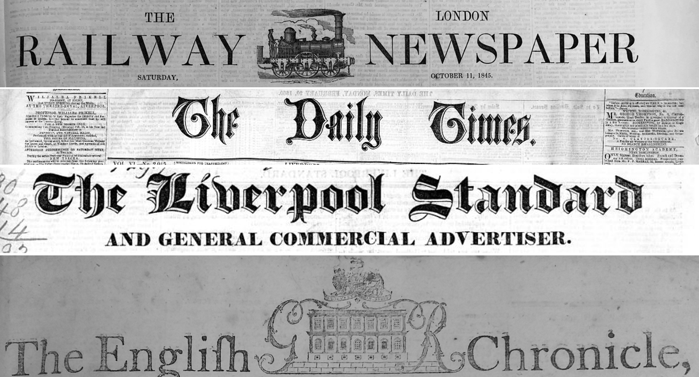
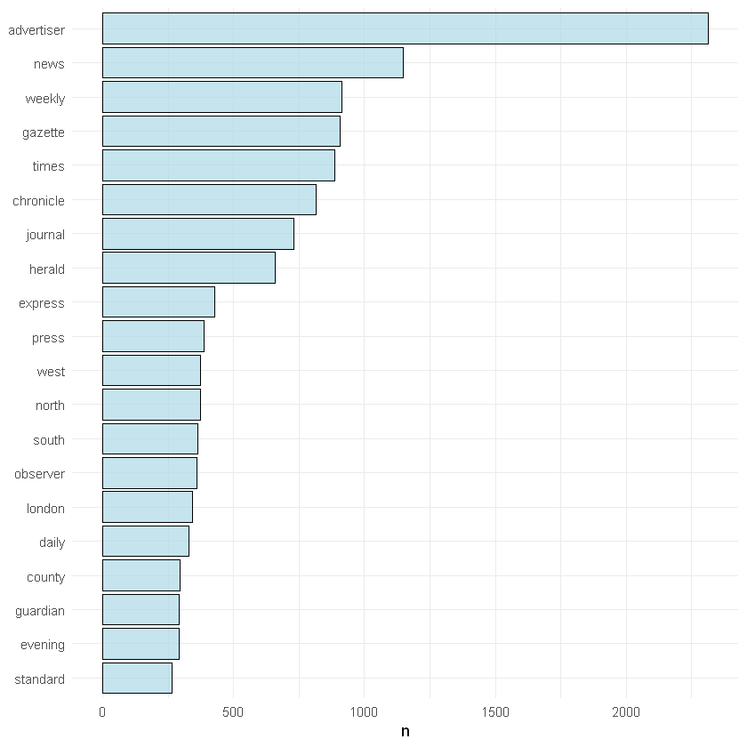
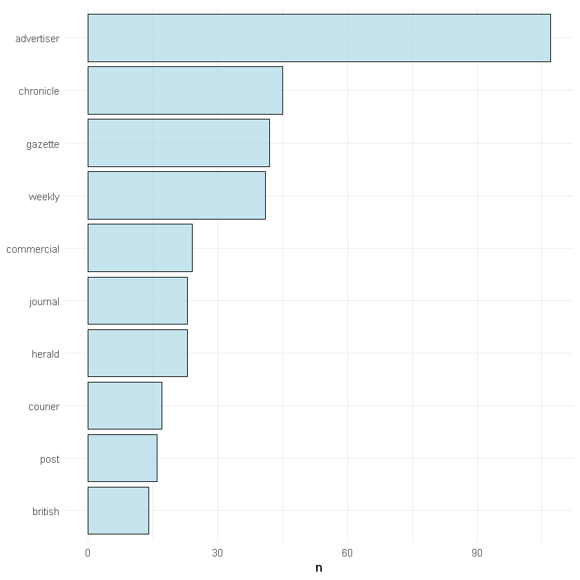
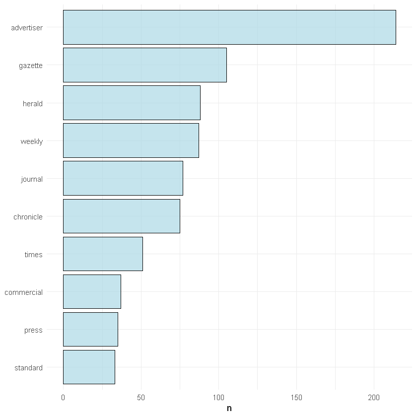
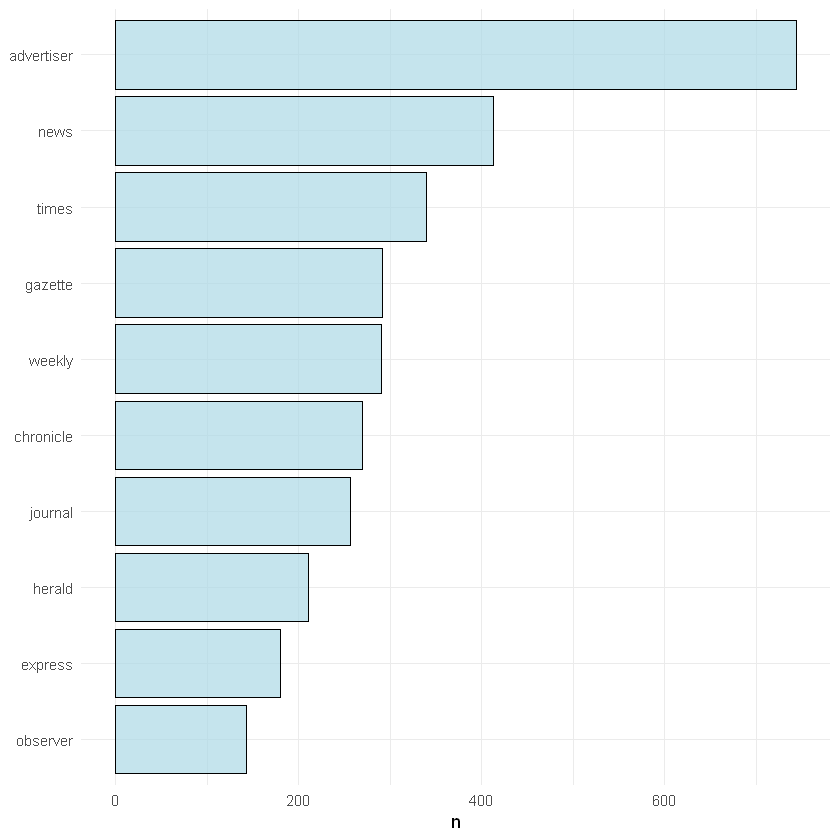
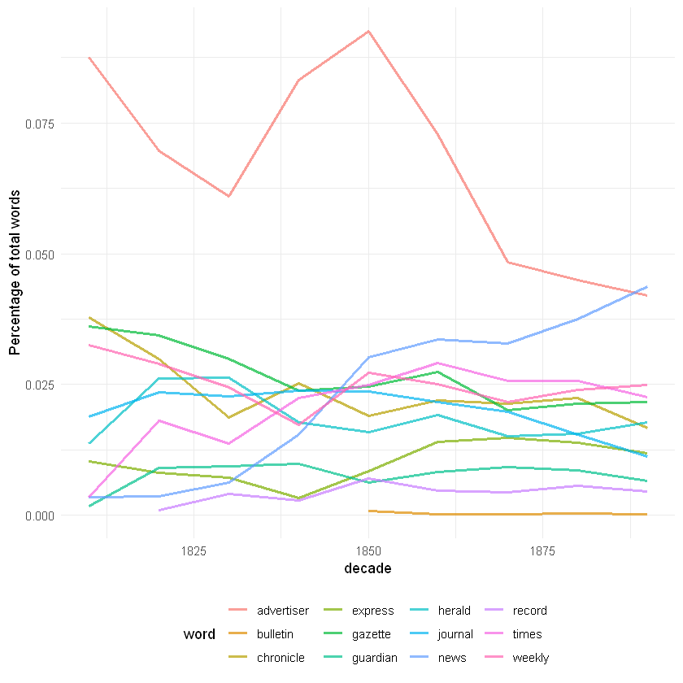
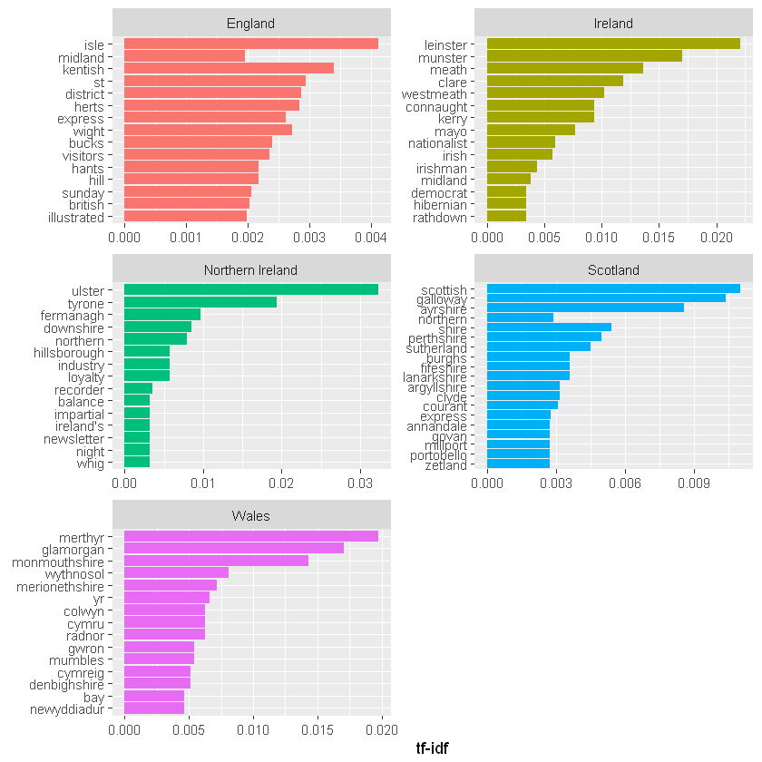

# UNDERSTANDING THE TITLE LIST

# _What were the most common words used in newspaper titles in the nineteenth century?_



### Titles don't just help you identity a newspaper, but they might tell you a little bit about the time in which they were established. With a bibliographic list of _all_ our UK and Irish titles, we can count the most frequent words and track them over time AND PLACE, using text mining and data analysis.

### What is this document?

This is a markdown file, made from a [Jupyter notebook](https://jupyter.org/). A jupyter notebook is usually an interactive document which can contain code, images and text, and a markdown file is a static version of that. Each bit of code runs in a cell, and the output is displayed directly below.

The code I've used is R, which is a language particularly good for data analysis, but another language, Python, is probably used in Jupyter more frequently. If you're going to work in R, I would recommend downloading [R-Studio](https://rstudio.com) to do all your work, which could then be copied-and-pasted over the Jupyter notebook if needed, like I've done here.

There are tonnes of places to get started working with R, Python, Jupyter notebooks and so forth, and we would recommend looking here in the first instance: 

https://programminghistorian.org/

https://software-carpentry.org/


First we need to load some libraries which we'll use. A library is just a bunch of functions* grouped together, usually with a particular overall purpose or theme. 

'tidyverse' is actually a number of libraries with hundreds of useful functions to make lots of data analysis easier. It includes a very powerful plotting library called 'ggplot2'. 

'readxl' is a library which.. reads excel files..

It's usually the first thing I load, before even deciding what I'm going to do with my data.

Lots of this code uses something called piping. This is a function in one of our tidyverse libraries which allows you to do something to your data, and then pass it along to _another_ function using this symbol: %>%

It allows you to string lots of changes to your data together in one block of code, so you might filter it, then pass the filtered data to another function which adds summarises it, and pass it on to another function which plots it as a graph. 


\* You might say a function is a pre-made block of code which does something to some data. It has a name and often one or more _arguments_. The first argument is often a space for you to specify the thing you want to do the function on, and subsequent arguments might be additional parameters.


```R
library(tidyverse)
library(readxl)
```

The first thing we do is load the whole title list as a variable called 'working_list', specifying the sheet of the excel file we'd like to use. We'll dive a little deeper into the structure and how we might filter in another notebook.


```R
working_list <- read_excel(
  "UK_Ireland_Newspapers_Title_Level_List.xlsx", 
                           sheet = "Title-level list")
```

Let's just look at the nineteenth century - we'll use the filter() function from dplyr, which is one of the libraries in the tidyverse. We then use %>% to pipe the filtered data to a function called head(), which displays a set number of rows of your data frama - useful for taking a peek at the structure.


```R
working_list %>% 
  filter(Last.date.held>1799) %>%
  filter(First.date.held<1900) %>% 
head(2)
```


<table>
<thead><tr><th scope=col>Title.ID</th><th scope=col>NID</th><th scope=col>NLP</th><th scope=col>Publication title</th><th scope=col>Edition</th><th scope=col>Preceding titles</th><th scope=col>Succeeding titles</th><th scope=col>Place.of.publication</th><th scope=col>Country.of.publication</th><th scope=col>General.area.of.coverage</th><th scope=col>...</th><th scope=col>First.date.held</th><th scope=col>Last.date.held</th><th scope=col>Publication.date.one</th><th scope=col>Publication.date.two</th><th scope=col>Current.publication.frequency</th><th scope=col>Publisher</th><th scope=col>Holdings..more.information</th><th scope=col>Free text information about dates of publication</th><th scope=col>Online.status</th><th scope=col>Link.to.BNA.digitised.resource</th></tr></thead>
<tbody>
	<tr><td>013774146                                                                                                                                           </td><td>NA                                                                                                                                                  </td><td>NA                                                                                                                                                  </td><td>London gazette                                                                                                                                      </td><td>NA                                                                                                                                                  </td><td>Continues: Oxford gazette                                                                                                                           </td><td>Continued by: Gazette (London) (ISSN: 2057-4436)                                                                                                    </td><td>London                                                                                                                                              </td><td>England                                                                                                                                             </td><td>NA                                                                                                                                                  </td><td>...                                                                                                                                                 </td><td>1666                                                                                                                                                </td><td>2014                                                                                                                                                </td><td>1666                                                                                                                                                </td><td>2014                                                                                                                                                </td><td>Daily|Daily (1914 August 2 -)|Semi-weekly (1666 - 1709 June 23)|Semi-weekly (1712 August 5 - 1914 July 31)|Tri-weekly (1709 June 25 - 1712 August 2)</td><td>T. Neuman                                                                                                                                           </td><td>Initially Oxford Gazette                                                                                                                            </td><td>1666 February 1 (number 24) -                                                                                                                       </td><td>BURNEY                                                                                                                                              </td><td>NA                                                                                                                                                  </td></tr>
	<tr><td>013943676                                                                                                                                           </td><td>0032666                                                                                                                                             </td><td>0000537                                                                                                                                             </td><td>The Newcastle Courant, etc                                                                                                                          </td><td>NA                                                                                                                                                  </td><td>NA                                                                                                                                                  </td><td>NA                                                                                                                                                  </td><td>NA                                                                                                                                                  </td><td>England                                                                                                                                             </td><td>Tyne and Wear                                                                                                                                       </td><td>...                                                                                                                                                 </td><td>1711                                                                                                                                                </td><td>1801                                                                                                                                                </td><td>1711                                                                                                                                                </td><td>1801                                                                                                                                                </td><td>NA                                                                                                                                                  </td><td>NA                                                                                                                                                  </td><td>no 2-6483 (4 August 1711-10 January 1801)                                                                                                           </td><td>NA                                                                                                                                                  </td><td>BNA                                                                                                                                                 </td><td>http://www.britishnewspaperarchive.co.uk/search/results?TitleId=BL/0000085                                                                          </td></tr>
</tbody>
</table>


We have some duplicated newspaper titles in this dataframe. We can get rid of these for this analysis, though there are reasons we left them in which I won't go into now.  We can delete any duplicated titles using a function called distinct() on NID id field.


```R
working_list %>%
  filter(Last.date.held>1799) %>%
  filter(First.date.held<1900) %>%
  distinct(NID, .keep_all = TRUE) %>%
head(2)
```


<table>
<thead><tr><th scope=col>Title.ID</th><th scope=col>NID</th><th scope=col>NLP</th><th scope=col>Publication title</th><th scope=col>Edition</th><th scope=col>Preceding titles</th><th scope=col>Succeeding titles</th><th scope=col>Place.of.publication</th><th scope=col>Country.of.publication</th><th scope=col>General.area.of.coverage</th><th scope=col>...</th><th scope=col>First.date.held</th><th scope=col>Last.date.held</th><th scope=col>Publication.date.one</th><th scope=col>Publication.date.two</th><th scope=col>Current.publication.frequency</th><th scope=col>Publisher</th><th scope=col>Holdings..more.information</th><th scope=col>Free text information about dates of publication</th><th scope=col>Online.status</th><th scope=col>Link.to.BNA.digitised.resource</th></tr></thead>
<tbody>
	<tr><td>013774146                                                                                                                                           </td><td>NA                                                                                                                                                  </td><td>NA                                                                                                                                                  </td><td>London gazette                                                                                                                                      </td><td>NA                                                                                                                                                  </td><td>Continues: Oxford gazette                                                                                                                           </td><td>Continued by: Gazette (London) (ISSN: 2057-4436)                                                                                                    </td><td>London                                                                                                                                              </td><td>England                                                                                                                                             </td><td>NA                                                                                                                                                  </td><td>...                                                                                                                                                 </td><td>1666                                                                                                                                                </td><td>2014                                                                                                                                                </td><td>1666                                                                                                                                                </td><td>2014                                                                                                                                                </td><td>Daily|Daily (1914 August 2 -)|Semi-weekly (1666 - 1709 June 23)|Semi-weekly (1712 August 5 - 1914 July 31)|Tri-weekly (1709 June 25 - 1712 August 2)</td><td>T. Neuman                                                                                                                                           </td><td>Initially Oxford Gazette                                                                                                                            </td><td>1666 February 1 (number 24) -                                                                                                                       </td><td>BURNEY                                                                                                                                              </td><td>NA                                                                                                                                                  </td></tr>
	<tr><td>013943676                                                                                                                                           </td><td>0032666                                                                                                                                             </td><td>0000537                                                                                                                                             </td><td>The Newcastle Courant, etc                                                                                                                          </td><td>NA                                                                                                                                                  </td><td>NA                                                                                                                                                  </td><td>NA                                                                                                                                                  </td><td>NA                                                                                                                                                  </td><td>England                                                                                                                                             </td><td>Tyne and Wear                                                                                                                                       </td><td>...                                                                                                                                                 </td><td>1711                                                                                                                                                </td><td>1801                                                                                                                                                </td><td>1711                                                                                                                                                </td><td>1801                                                                                                                                                </td><td>NA                                                                                                                                                  </td><td>NA                                                                                                                                                  </td><td>no 2-6483 (4 August 1711-10 January 1801)                                                                                                           </td><td>NA                                                                                                                                                  </td><td>BNA                                                                                                                                                 </td><td>http://www.britishnewspaperarchive.co.uk/search/results?TitleId=BL/0000085                                                                          </td></tr>
</tbody>
</table>


Select only the information we need. Let's create a new dataframe, run the filter and distinct functions, and select some date information along with the titles, Afterwards we might want to choose geographic information instead, so we'll keep our original data frame:


```R
titles_dates = working_list %>% 
 filter(Last.date.held>1799) %>%
  filter(First.date.held<1900) %>%
  distinct(NID, .keep_all = TRUE) %>%
  select(`Publication title`, First.date.held)
```

To count the title keywords, we can tokenise our data. This splits everything into individual words. For this we need to load a library called 'tidytext', which contains lots of functions for text mining. 


```R
library(tidytext)
```


```R
tokenised_titles_dates = titles_dates %>%
  unnest_tokens(word, `Publication title`)
```

Now we'll get rid of stopwords - the very frequently-used words like 'the' or 'an' and so forth. It's not always appropriate to remove stopwords, and in fact sometimes they are the most interesting, but I think here it will make things easier to manage. 


```R
data(stop_words) # this loads a dataset of stopwords
```


```R
tokenised_titles_dates = tokenised_titles_dates %>% 
  anti_join(stop_words) # this does an 'anti-join' which removes any word in one list which also appears in another.
```

    Joining, by = "word"
    

Let's do some simple analysis first. We can count the most common words overall:


```R
tokenised_titles_dates %>%
  count(word, sort = TRUE) %>% head(20)
```


<table>
<thead><tr><th scope=col>word</th><th scope=col>n</th></tr></thead>
<tbody>
	<tr><td>advertiser</td><td>2314      </td></tr>
	<tr><td>news      </td><td>1147      </td></tr>
	<tr><td>weekly    </td><td> 915      </td></tr>
	<tr><td>gazette   </td><td> 907      </td></tr>
	<tr><td>times     </td><td> 886      </td></tr>
	<tr><td>chronicle </td><td> 816      </td></tr>
	<tr><td>journal   </td><td> 731      </td></tr>
	<tr><td>herald    </td><td> 658      </td></tr>
	<tr><td>express   </td><td> 427      </td></tr>
	<tr><td>press     </td><td> 388      </td></tr>
	<tr><td>north     </td><td> 374      </td></tr>
	<tr><td>west      </td><td> 374      </td></tr>
	<tr><td>south     </td><td> 365      </td></tr>
	<tr><td>observer  </td><td> 361      </td></tr>
	<tr><td>london    </td><td> 343      </td></tr>
	<tr><td>daily     </td><td> 331      </td></tr>
	<tr><td>county    </td><td> 297      </td></tr>
	<tr><td>evening   </td><td> 292      </td></tr>
	<tr><td>guardian  </td><td> 292      </td></tr>
	<tr><td>standard  </td><td> 264      </td></tr>
</tbody>
</table>


We can turn it into a bar chart. 


```R
tokenised_titles_dates %>%
  count(word, sort = TRUE) %>%
  mutate(word = reorder(word, n)) %>%
 head(20) %>%
  ggplot(aes(word, n)) +
  geom_col(fill = 'lightblue', color = 'black', alpha = .7) +
  xlab(NULL) +
  theme_minimal() +
  coord_flip()
```





Advertiser is the most popular word in a title! Lots of other words which would be expected, like 'news', 'daily', 'evening' and so forth. It might be more interesting to compare across time. 

This adds a new column with the date 'floored' to the previous 20. When we group and count again, everything between 1800 and 1819 will become 1800, everything between 1820 and 1839 will become 1820 and so forth.


```R
tokenised_titles_dates = tokenised_titles_dates %>%
  mutate(timespan = First.date.held - First.date.held %% 20)
```

Now look at the top ten title words for each of these twenty-year periods:

1800 - 1819:


```R
tokenised_titles_dates %>%
  filter(timespan == '1800') %>% 
  count(word, sort = TRUE) %>%
  ungroup() %>% 
  mutate(word = reorder(word, n)) %>%
  head(10) %>%
  ggplot(aes(word, n)) +
  geom_col(fill = 'lightblue', color = 'black', alpha = .7) +
  xlab(NULL) +
  theme_minimal() +
  coord_flip()
```





1820 - 1839:


```R
tokenised_titles_dates %>%
  filter(timespan == '1820') %>% 
  count(word, sort = TRUE) %>%
  ungroup() %>% 
  mutate(word = reorder(word, n)) %>%
  head(10) %>%
  ggplot(aes(word, n)) +
  geom_col(fill = 'lightblue', color = 'black', alpha = .7) +
  xlab(NULL) +
  theme_minimal() +
  coord_flip()
```





1840 - 1859 (it's interesting how 'British' has fallen out of the top ten, and 'north' and 'south' have been bumped up. Even something this simple can confirming interesting things about the growth of the regional press!


```R
tokenised_titles_dates %>%
  filter(timespan == '1840') %>% 
  count(word, sort = TRUE) %>%
  ungroup() %>% 
  mutate(word = reorder(word, n)) %>% 
  head(10) %>%
  ggplot(aes(word, n)) +
  geom_col(fill = 'lightblue', color = 'black', alpha = .7) +
  xlab(NULL) +
  theme_minimal() +
  coord_flip()
```


1860 - 1879:


```R
tokenised_titles_dates %>%
  filter(timespan == '1860') %>% 
  count(word, sort = TRUE) %>%
  ungroup() %>% 
  mutate(word = reorder(word, n)) %>%
  head(10) %>%
  ggplot(aes(word, n)) +
  geom_col(fill = 'lightblue', color = 'black', alpha = .7) +
  xlab(NULL) +
  theme_minimal() +
  coord_flip()
```





1880 - 1899


```R
tokenised_titles_dates %>%
  filter(timespan == '1880') %>% 
  count(word, sort = TRUE) %>%
  ungroup() %>% 
  filter(n > 100) %>%
  mutate(word = reorder(word, n)) %>%
  ggplot(aes(word, n)) +
  geom_col(fill = 'lightblue', color = 'black', alpha = .7) +
  xlab(NULL) +
  theme_minimal() +
  coord_flip()
```


There might be better ways of counting. How about a line chart which tracks a certain number of keywords over time?

We know that the number of titles per year increases a lot over the century, so we'll need to make a relative rather than absolute values. This next bit adds a count of _all_ the words per decade, and puts it beside each word. Then we can divide one by the other and get a fraction. I'll show the first few lines of each dataframe to show what I mean.


```R
title_words = tokenised_titles_dates %>%
  mutate(decade = First.date.held - First.date.held %% 10) %>% 
  count(decade, word, sort = TRUE)
head(title_words, 5)
```


<table>
<thead><tr><th scope=col>decade</th><th scope=col>word</th><th scope=col>n</th></tr></thead>
<tbody>
	<tr><td>1850      </td><td>advertiser</td><td>500       </td></tr>
	<tr><td>1860      </td><td>advertiser</td><td>423       </td></tr>
	<tr><td>1870      </td><td>advertiser</td><td>321       </td></tr>
	<tr><td>1880      </td><td>advertiser</td><td>286       </td></tr>
	<tr><td>1890      </td><td>news      </td><td>271       </td></tr>
</tbody>
</table>


```R
total_words <- title_words %>% 
  group_by(decade) %>% 
  summarize(total = sum(n))

head(total_words, 5)
```


<table>
<thead><tr><th scope=col>decade</th><th scope=col>total</th></tr></thead>
<tbody>
	<tr><td>1660</td><td> 2  </td></tr>
	<tr><td>1710</td><td> 2  </td></tr>
	<tr><td>1720</td><td>17  </td></tr>
	<tr><td>1730</td><td>13  </td></tr>
	<tr><td>1740</td><td>16  </td></tr>
</tbody>
</table>


```R
title_words <- left_join(title_words, total_words)
head(title_words, 5)
```

    Joining, by = "decade"
    


<table>
<thead><tr><th scope=col>decade</th><th scope=col>word</th><th scope=col>n</th><th scope=col>total</th></tr></thead>
<tbody>
	<tr><td>1850      </td><td>advertiser</td><td>500       </td><td>5408      </td></tr>
	<tr><td>1860      </td><td>advertiser</td><td>423       </td><td>5815      </td></tr>
	<tr><td>1870      </td><td>advertiser</td><td>321       </td><td>6641      </td></tr>
	<tr><td>1880      </td><td>advertiser</td><td>286       </td><td>6367      </td></tr>
	<tr><td>1890      </td><td>news      </td><td>271       </td><td>6198      </td></tr>
</tbody>
</table>


We'll pick a list of terms to plot, because otherwise it'll be unreadable.


```R
top_terms = c('advertiser',
              'news',
              'weekly',
              'times',
              'gazette',
              'chronicle',
              'herald',
              'journal', 
              'express',
              'bulletin',
              'record',
              'guardian',
              'express')
```

Now we draw a plot, using n/total as the y-axis variable to plot the fraction of the total:


```R
title_words %>%
  filter(word %in% top_terms) %>% 
  filter(decade >1800) %>% 
  ggplot(aes(x = decade, y = n/total, color = word)) + 
  geom_line(size = 1, alpha = .7,stat = 'identity') + 
  theme_minimal() + 
  ylab(label = "Percentage of total words") + theme(legend.position = 'bottom')
```





Well, that's quite interesting. Advertiser declines in the second half of the century, and is overtaken by 'news' right at the end.

### How about differences by country?

Go back to the working list and make a version with country information:


```R
titles_countries = working_list %>% 
  select(`Publication title`, Country.of.publication)

tokenised_titles_countries = titles_countries %>%
  unnest_tokens(word, `Publication title`)

tokenised_titles_countries = tokenised_titles_countries %>% 
  anti_join(stop_words)
```

    Joining, by = "word"
    


```R
Let's make an overall chart for each country:
```


    Error in parse(text = x, srcfile = src): <text>:1:4: unexpected INCOMPLETE_STRING
    1: Let's make an overall chart for each country:
           ^
    Traceback:
    


England:


```R
tokenised_titles_countries %>%
  filter(Country.of.publication == 'England') %>% 
  count(word, sort = TRUE) %>%
  ungroup() %>% 
  mutate(word = reorder(word, n)) %>%
  head(15) %>%
  ggplot(aes(word, n)) +
  geom_col(fill = 'lightblue', color = 'black', alpha = .7) +
  xlab(NULL) +
  theme_minimal() +
  coord_flip()
```

Scotland:


```R
tokenised_titles_countries %>%
  filter(Country.of.publication == 'Scotland') %>% 
  count(word, sort = TRUE) %>%
  ungroup() %>% 
  filter(n > 40) %>%
  mutate(word = reorder(word, n)) %>%
  head(15) %>%
  ggplot(aes(word, n)) +
  geom_col(fill = 'lightblue', color = 'black', alpha = .7) +
  xlab(NULL) +
  theme_minimal() +
  coord_flip()
```

Ireland:


```R
tokenised_titles_countries %>%
  filter(Country.of.publication %in% c('Ireland', 'Northern Ireland')) %>% 
  count(word, sort = TRUE) %>%
  ungroup() %>% 
  mutate(word = reorder(word, n)) %>%
  head(15) %>%
  ggplot(aes(word, n)) +
  geom_col(fill = 'lightblue', color = 'black', alpha = .7) +
  xlab(NULL) +
  theme_minimal() +
  coord_flip()
```

Wales:


```R
tokenised_titles_countries %>%
  filter(Country.of.publication == 'Wales') %>% 
  count(word, sort = TRUE) %>%
  ungroup() %>% 
  mutate(word = reorder(word, n)) %>%
 head(15) %>%
  ggplot(aes(word, n)) +
  geom_col(fill = 'lightblue', color = 'black', alpha = .7) +
  xlab(NULL) +
  theme_minimal() +
  coord_flip()
```

How about looking for the most unique terms for each country? That might tell us something interesting. 

First we'll select just the key countries: 


```R
countryList = c('England', 'Ireland', 'Wales', 'Scotland', 'Northern Ireland')
```

Next we'll use a function which gives the 'tf-idf' score for each word. This measures the frequency of the word in comparison to its frequency in all other countries, giving us words that are more unique to titles from that country. 


```R
total_by_country = tokenised_titles_countries %>%
  filter(Country.of.publication %in% countryList) %>% 
  count(Country.of.publication, word, sort = TRUE)
  

total_by_country <- total_by_country %>%
  bind_tf_idf(word, Country.of.publication, n)
```


```R
total_by_country %>%
  arrange(desc(tf_idf)) %>%
  mutate(word = factor(word, levels = rev(unique(word)))) %>% 
  group_by(Country.of.publication) %>% 
  top_n(15) %>% 
  ungroup() %>%
  ggplot(aes(word, tf_idf, fill = Country.of.publication)) +
  geom_col(show.legend = FALSE) +
  labs(x = NULL, y = "tf-idf") +
  facet_wrap(~Country.of.publication, ncol = 2, scales = "free") +
  coord_flip()
```

Unsurprisingly, this mostly gives us placenames, as used in the titles, which are obviously only going to be used in one country. There's a couple of interesting things: 'Wales' and 'Scotland' have a high score, but not 'Ireland'. Why would Ireland not be used in a newspaper title in the same way as Welsh or Scottish newspapers?

We need a way to try and filter out geographic places as they're drowning out other potentially interesting terms. We can make a list of places from our original title list which would be a good start. 


```R
all_places = read_excel(
  "UK_Ireland_Newspapers_Title_Level_List.xlsx", 
  sheet = "Title-level list")

list_of_places = c(all_places$First.geographical.subject.heading, 
                             all_places$Subsequent.geographical.subject.headings,
                             all_places$General.area.of.coverage,
                             all_places$Coverage..City,
                             all_places$Place.of.publication,
                             all_places$Country.of.publication)

list_of_places = as.data.frame(list_of_places) %>% 
  group_by(list_of_places) %>% count() %>% select(list_of_places)

list_of_places = tolower(list_of_places$list_of_places)
```

    Warning message:
    "Factor `list_of_places` contains implicit NA, consider using `forcats::fct_explicit_na`"Warning message:
    "Factor `list_of_places` contains implicit NA, consider using `forcats::fct_explicit_na`"

It's a bit crude but it's given us a list of 5,000 or so places which we can use to filter our word list. 

Plotting the filtered list:


```R
total_by_country %>%
  filter(!word %in% list_of_places) %>%
  arrange(desc(tf_idf)) %>%
  mutate(word = factor(word, levels = rev(unique(word)))) %>%
  group_by(Country.of.publication) %>% 
  top_n(15) %>% 
  ungroup() %>%
  ggplot(aes(word, tf_idf, fill = Country.of.publication)) +
  geom_col(show.legend = FALSE) +
  labs(x = NULL, y = "tf-idf") +
  facet_wrap(~Country.of.publication, ncol = 2, scales = "free") +
  coord_flip()
```

    Selecting by tf_idf
    





There are still lots of geographic terms, but there are some other words 'unique' to each country. Ireland and Northern Ireland high-scoring words are particularly interesting (of course we're looking at 19th century titles so the division is meaningless, but it still represents some kind of regionality). Only Irish titles tend to have ideological terms like 'nationalist', 'democrat', 'loyalty', 'impartial' and so forth. Newspapers with 'illustrated' or 'Sunday' in the title are unique to England, and, intriguingly, 'visitors'.


```R

```
